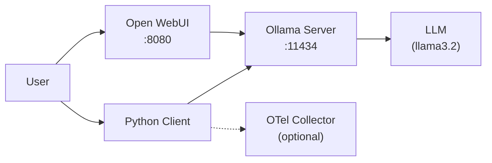

# docker-compose-ollama

Run [Ollama](https://ollama.ai/) locally using Docker Compose with an [Open WebUI](https://github.com/open-webui/open-webui) interface. The llama3.2 model is automatically pulled during the Docker build.



## Quickstart

```bash
docker compose up -d
```

By default, `.env` sets `COMPOSE_PROFILES=ollama-only,webui` to run both services:
- Open WebUI: `http://localhost:8080`
- Ollama API: `http://localhost:11434`

### Ollama Only

To run without the web interface, edit `.env`:

```
COMPOSE_PROFILES=ollama-only
```

Then interact via CLI:

```bash
docker exec -it ollama ollama run llama3.2
```

## Python Examples

- `openai-example.py` - Basic chat completion using OpenAI SDK
- `openai-with-otel-example.py` - Same example with OpenTelemetry tracing

```bash
uv run examples/openai-example.py
uv run examples/openai-with-otel-example.py
```
